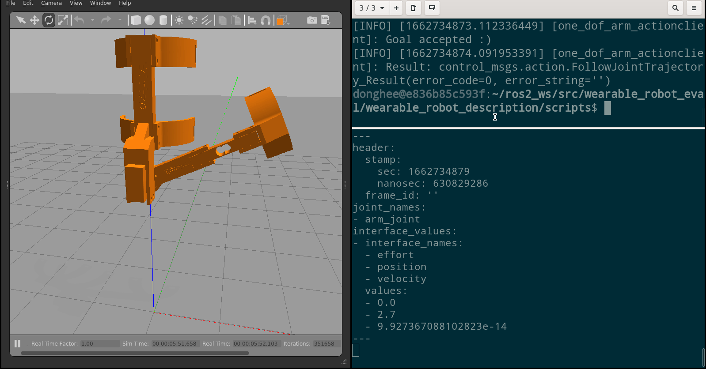
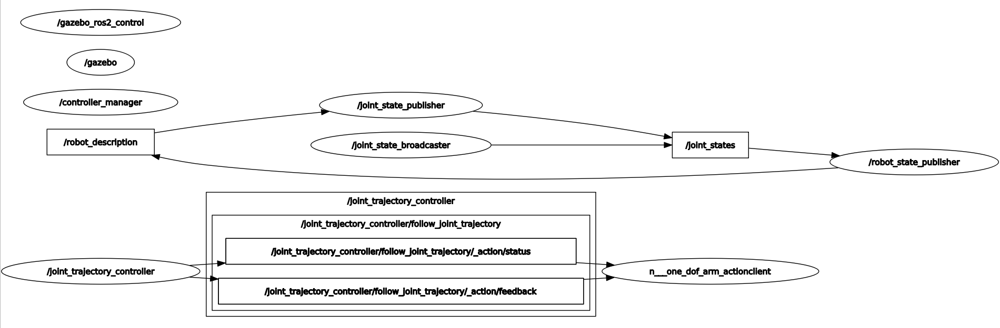
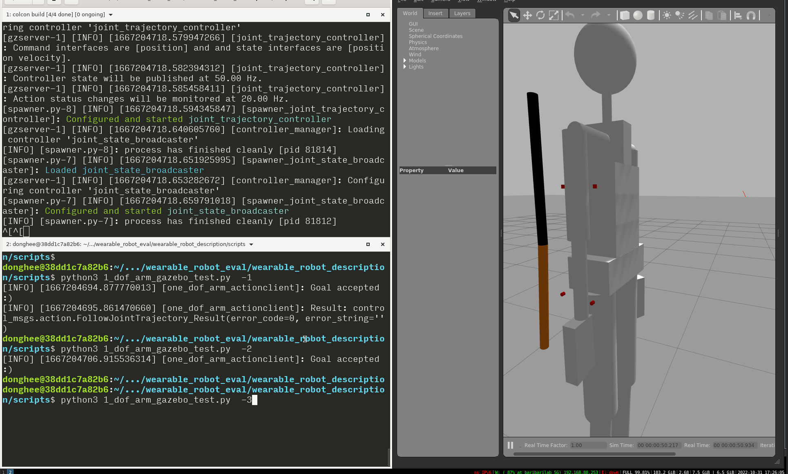

# 웨어러블 로봇 평가 시스템 환경 구성

docker를 이용하여 웨어러블 로봇 평가를 위한 ROS 패키지 설치

### 요구사항

* Ubuntu 20.04 또는 Ubuntu 22.04
* Docker 설치
* Gazebo 3D 시뮬레이터 원활히 작동 하는 환경

### 설치 순서

1\. Ubuntu 20.04 또는 Ubuntu 22.04 설치

2\. Docker 설치

3\. ROS2 foxy 실행&#x20;

```
xhost +local:root

docker run -it \
    --privileged -v /dev/bus/usb:/dev/bus/usb \
    --user $(id -u) \
    --env="DISPLAY" \
    --env="QT_X11_NO_MITSHM=1" \
    --workdir="/home/$USER" \
    --volume="/home/$USER:/home/$USER" \
    --volume="/etc/group:/etc/group:ro" \
    --volume="/etc/passwd:/etc/passwd:ro" \
    --volume="/etc/shadow:/etc/shadow:ro" \
    --volume="/etc/sudoers.d:/etc/sudoers.d:ro" \
    --volume="/tmp/.X11-unix:/tmp/.X11-unix:rw" \
    osrf/ros:foxy-desktop \
    bash
```

4\. 도커 컨테이너에서 다음 명령 실행하여 필요한 패키지 설치

```
sudo apt install ros-foxy-gazebo-dev ros-foxy-gazebo-plugins ros-foxy-gazebo-msgs ros-foxy-gazebo-ros-pkgs ros-foxy-gazebo-ros ros-foxy-ros-core ros-foxy-geometry2
sudo apt install ros-foxy-joint-state-publisher-gui ros-foxy-xacro
sudo apt install ros-foxy-gazebo-ros2-control ros-foxy-ros2-controllers ros-foxy-controller-manager ros-foxy-gazebo-ros2-control ros-foxy-ros2-controllers
```

5\. 웨어러블 로봇 소스 저장소 받아 빌드

```
source /opt/ros/foxy/setup.bash
mkdir -p ~/ros2_ws/src
cd ~/ros2_ws/src
git clone git@github.com:donghee/wearable_robot_eval.git
cd ~/ros2_ws/
colcon build
source ./install/setup.bash

ros2 launch wearable_robot_gazebo 1_dof_arm.launch.py
# or
ros2 launch wearable_robot_gazebo eduexo.launch.py
# or
ros2 launch wearable_robot_gazebo human.launch.py
```

<!--
<figcaption><p>eduexo.launch.py 실행</p></figcaption>
-->


# human  모델 조사

gazebo에서 사용할 수 있는 인간 모델 조사

### URDF를 이용하여 human 모델링한 사례

* 관절이 있는 타입: human-gazebo, 사람의 관절을 link와 joint를 구성
  * [https://github.com/robotology/human-gazebo/tree/master/humanSubject01](https://github.com/robotology/human-gazebo/tree/master/humanSubject01)&#x20;
* 관절이 없는 타입:  3d collada 파일에 애니메이션 추가하여 사용
  * [https://classic.gazebosim.org/tutorials?tut=actor\&cat=build\_robot](https://classic.gazebosim.org/tutorials?tut=actor\&cat=build\_robot)&#x20;
* 피부가 있는 타입: makehuman 이용하여 인간 모델을 3d collada파일 보내고, urdf로 조립&#x20;
  * [https://github.com/valegagge/humanModels](https://github.com/valegagge/humanModels)

### human gazebo


#### human gazebo udf 생성기(파이썬)

[https://github.com/ami-iit/human-model-generator](https://github.com/ami-iit/human-model-generator)


<!--
<figcaption></figcaption>
-->

### MakeHuman

MakeHuman 이용하여 Gazebo에 human 모델 추가&#x20;

<!--
<figcaption></figcaption>
-->


MakeHuman: 인간 모델 생성기&#x20;

<!--
<figcaption></figcaption>
-->


<!--
<figcaption><p>뼈대 생성</p></figcaption>
-->


### 참고:

* anybody human-exoskeleton 디자인 도구


# 시뮬레이터 센서 조사

### **새로운 센서 모델링**&#x20;

Gazebo 시뮬레이터에서 새로운 센서 모델링하기 위해서는 기존의 Gazebo 플러그인을 이용하거나 새로운 센서를 만들어서 센서 값을 센서 모델링을 한다.

### Gazebo 기존 센서 조사

#### 토크 센서&#x20;

* 토크센서 플러그인: [http://osrf-distributions.s3.amazonaws.com/gazebo/api/11.0.0/classgazebo\_1\_1ForceTorquePlugin.html](http://osrf-distributions.s3.amazonaws.com/gazebo/api/11.0.0/classgazebo\_1\_1ForceTorquePlugin.html)
* 토크센서 플러그인 예시: [https://classic.gazebosim.org/tutorials?tut=force\_torque\_sensor\&cat=sensors](https://classic.gazebosim.org/tutorials?tut=force\_torque\_sensor\&cat=sensors)

토크 센서 붙이는 방법:  gazebo 시뮬레이터에서는 joint에 토크센서 플러그인을 붙이기 때문에, 다음 그림처럼 모델링 필요.


<!--
<div>

<figcaption></figcaption>

<figcaption></figcaption>

</div>
-->

#### 근전도 센서

* Gazebo에는 구현된 것 없음.&#x20;
* 구현 한다면 하드웨어 myo armband 메시지 토픽을 생성하여 보내야 한다.
  * ros myo: [https://github.com/uts-magic-lab/ros\_myo](https://github.com/uts-magic-lab/ros\_myo)
  * [https://github.com/Calima94/my\_arm\_def/blob/master/src/my\_arm\_def\_py\_pkg/my\_arm\_def\_py\_pkg/myo\_raw.py](https://github.com/Calima94/my\_arm\_def/blob/master/src/my\_arm\_def\_py\_pkg/my\_arm\_def\_py\_pkg/myo\_raw.py)

#### 촉각피드백(택타일)센서&#x20;

* Gazebo에는 구현된 것 없음.&#x20;
* 촉각센서 시뮬레이션: Gazebo 안의 joints 위치값을 더하여 이용하여 촉각 구현
  * 참고: [https://github.com/shadow-robot/sr\_core/blob/v1.0.2/sr\_hand/src/hand/virtual\_shadowhand.cpp](https://github.com/shadow-robot/sr\_core/blob/v1.0.2/sr\_hand/src/hand/virtual\_shadowhand.cpp)
  * [https://github.com/shadow-robot/sr\_core/blob/f8ccc3c3eb3341485979659cd670b594673b3006/sr\_tactile\_sensors/src/sr\_virtual\_tactile\_sensor.cpp#L85](https://github.com/shadow-robot/sr\_core/blob/f8ccc3c3eb3341485979659cd670b594673b3006/sr\_tactile\_sensors/src/sr\_virtual\_tactile\_sensor.cpp#L85)

#### 접촉센서

* Gazebo의 촉각 센서:  [http://osrf-distributions.s3.amazonaws.com/gazebo/api/11.0.0/classgazebo\_1\_1sensors\_1\_1ContactSensor.html](http://osrf-distributions.s3.amazonaws.com/gazebo/api/11.0.0/classgazebo\_1\_1sensors\_1\_1ContactSensor.html)


# 제어기(Control)

제어기: 입력 신호를 받아서 원하는 움직임(위치, 속도, 힘)이 되도록 출력 신호를 보낸다.

웨어러블 로봇 평가 시스템에서는 제어기로 ros2\_control 패키지를 사용.&#x20;


<!--
<figcaption></figcaption>

제어 루프

<figcaption></figcaption>
-->

# 1 자유도 로봇 모델 제작

### 목적

실제 웨어러블 로봇의 제작을 앞서 가제보와 ROS의 기능 테스트를 위한 간단 버전 로봇 모델 제작

#### 개발 환경

* URDF 뷰어: vscode에서 ros\_extension을 설치하여 URDF 결과물을 미리 보면서 편집&#x20;
* ROS 2 개발환경:  Ubuntu 20.04, ROS 2 Foxy, Gazebo 11

#### Gazebo에서 로봇 모델 작성하는 순서&#x20;

1​. URDF 작성.

2\. robot state publisher 노드 를 이용하여  robot\_description 노드에 로봇의 URDF 보내기.

3​. gazebo에 URDF로 정의된 로봇 올리기:  spawn\_entity.py

4​ joint state publisher와 joint state broadcaster 노드 를 이용하여 joint 상태를 토픽으로 출판.

5\. joint trajetory controller 노드 를 이용하여 robot의 joint를 ROS action으로 제어하도록 인터페이스 연결

### 구현 <a href="#undefined-2" id="undefined-2"></a>

[https://github.com/donghee/wearable\_robot\_eval](https://github.com/donghee/wearable\_robot\_eval)

`colcon build && source ./install/setup.bash && ros2 launch wearable_robot_gazebo 1_dof_arm.launch.py`

<!--
<figcaption></figcaption>
-->


#### 1 자유도 로봇

1​ 자유도 로봇 모델&#x20;

URDF 파일

```
<?xml version="1.0"?>
<robot name="1_dof_arm" xmlns:xacro="http://www.ros.org/wiki/xacro">

  <!-- Import all Gazebo-customization elements, including Gazebo colors -->
  <xacro:include filename="$(find wearable_robot_description)/urdf/1_dof_arm.gazebo"/>
  <!-- Import Rviz colors -->
  <xacro:include filename="$(find wearable_robot_description)/urdf/materials.xacro"/>

    <link name="world"/>

    <joint name="fixed" type="fixed">
        <parent link="world"/>
        <child link="arm_link"/>
    </joint>

    <link name="arm_link">
        <visual>
            <geometry>
                <cylinder length="0.3" radius="0.01"/>
            </geometry>
            <origin rpy="0 0 1.570796" xyz="0.72 1 1.275"/>
            <material name="blue">
                <color rgba="0 0 1 1"/>
            </material>
        </visual>
        <collision>
            <geometry>
                <cylinder length="0.3" radius="0.01"/>
            </geometry>
            <origin rpy="0 0 1.570796" xyz="0.72 1 1.275"/>
        </collision>
        <inertial>
            <mass value="0.5"/>
            <inertia ixx="1.0" ixy="0.0" ixz="0.0" iyy="1.0" iyz="0.0" izz="1.0"/>
        </inertial>
    </link>

    <joint name="arm_joint" type="revolute">
        <parent link="arm_link"/>
        <child link="forearm_link"/>
        <origin xyz="0.72 1 1.125"/>
        <axis xyz="0 0 0" />
        <!-- <limit effort="300" velocity="0.1" lower="4.71" upper="1.8"/> -->
        <limit effort="300" velocity="0.1" lower="-4.1" upper="-1.5"/>
        <dynamics damping="50" friction="1"/>
    </joint>

    <link name="forearm_link">
        <visual>
            <geometry>
                <cylinder length="0.25" radius="0.01"/>
            </geometry>
            <origin rpy="1.570796 0 0" xyz="0 0.125 0"/>
            <material name="red">
                <color rgba="1 0 0 1"/>
            </material>
        </visual>
        <collision>
            <geometry>
                <cylinder length="0.25" radius="0.01"/>
            </geometry>
            <origin rpy="1.570796 0 0" xyz="0 0.125 0"/>
        </collision>
        <inertial>
            <mass value="0.5"/>
            <inertia ixx="1.0" ixy="0.0" ixz="0.0" iyy="1.0" iyz="0.0" izz="1.0"/>
        </inertial>
    </link>

    <joint name="forearm_band_link_fix_to_forearm_link" type="fixed">
      <origin xyz="0.12 0.18 0.05" rpy="0 1.570796 0"/>
      <parent link="forearm_link"/>
      <child link="forearm_band_link"/>
    </joint>

    <link name="forearm_band_link">
      <visual>
        <geometry>
          <cylinder length="0.01" radius="0.005"/>
        </geometry>
        <origin rpy="0 0 0" xyz="0 0 0"/>
        <material name="red">
          <color rgba="1 0 0 1"/>
        </material>
      </visual>
      <visual>
        <geometry>
          <cylinder length="0.01" radius="0.005"/>
        </geometry>
        <origin rpy="0 0 0" xyz="0.1 0 0"/>
        <material name="red">
          <color rgba="1 0 0 1"/>
        </material>
      </visual>
      <collision>
        <geometry>
          <cylinder length="0.05" radius="0.02"/>
        </geometry>
        <origin rpy="0 0 0" xyz="0 0 0"/>
        <contact_coefficients mu="2.0" kp="2.0" kd="2.0" />
      </collision>
      <collision>
        <geometry>
          <cylinder length="0.05" radius="0.02"/>
        </geometry>
        <origin rpy="0 0 0" xyz="0.1 0 0"/>
        <contact_coefficients mu="2.0" kp="2.0" kd="2.0" />
      </collision>
      <inertial>
        <mass value="0.1"/>
        <inertia ixx="1e-2" iyy="1e-2" izz="1e-2" ixy="0" ixz="0" iyz="0"/>
      </inertial>
    </link>

    <joint name="arm_band_link_fix_to_arm_link" type="fixed">
      <!-- <origin xyz="0.12 0.19 0.05" rpy="0 1.570796 0"/> -->
      <origin xyz="0.85 0.95 1.25" rpy="0 0 1.570796"/>
      <axis xyz="0 0 0" />
      <parent link="arm_link"/>
      <child link="arm_band_link"/>
    </joint>

    <link name="arm_band_link">
      <visual>
        <geometry>
          <cylinder length="0.01" radius="0.005"/>
        </geometry>
        <origin rpy="0 0 0" xyz="0.0 0 0"/>
        <material name="red">
          <color rgba="1 0 0 1"/>
        </material>
      </visual>
      <visual>
        <geometry>
          <cylinder length="0.01" radius="0.005"/>
        </geometry>
        <origin rpy="0 0 0" xyz="0.1 0 0"/>
        <material name="red">
          <color rgba="1 0 0 1"/>
        </material>
      </visual>
      <collision>
        <geometry>
          <cylinder length="0.05" radius="0.005"/>
        </geometry>
        <origin rpy="0 0 0" xyz="0 0 0"/>
        <contact_coefficients mu="2.0" kp="2.0" kd="2.0" />
      </collision>
      <collision>
        <geometry>
          <cylinder length="0.05" radius="0.005"/>
        </geometry>
        <origin rpy="0 0 0" xyz="0.1 0 0"/>
        <contact_coefficients mu="2.0" kp="2.0" kd="2.0" />
      </collision>
      <inertial>
        <mass value="0.1"/>
        <inertia ixx="1e-2" iyy="1e-2" izz="1e-2" ixy="0" ixz="0" iyz="0"/>
      </inertial>
    </link>

  <ros2_control name="GazeboSystem" type="system">
    <hardware>
      <plugin>gazebo_ros2_control/GazeboSystem</plugin>
    </hardware>
    <joint name="arm_joint">
      <command_interface name="position">
        <param name="min">1.79</param>
        <param name="max">6.28</param>
      </command_interface>
      <state_interface name="position"/>
      <state_interface name="velocity"/>
    </joint>
  </ros2_control>

</robot>

```

#### joint 제어

```
from math import sin, cos, pi
import rclpy
from rclpy.node import Node
from rclpy.qos import QoSProfile
from geometry_msgs.msg import Quaternion
from sensor_msgs.msg import JointState

class StatePublisher(Node):

    def __init__(self):
        rclpy.init()
        super().__init__('state_publisher')

        qos_profile = QoSProfile(depth=10)
        self.joint_pub = self.create_publisher(JointState, 'joint_states', qos_profile)
        self.nodeName = self.get_name()
        self.get_logger().info("{0} started".format(self.nodeName))

        degree = pi / 180.0
        loop_rate = self.create_rate(10)

        # robot state
        tilt_joint = 2.0
        tinc = degree
        tinc = 0.15

        joint_state = JointState()

        try:
            while rclpy.ok():
                rclpy.spin_once(self)

                # update joint_state
                now = self.get_clock().now()
                joint_state.header.stamp = now.to_msg()
                joint_state.name = ['tilt_joint']
                joint_state.position = [tilt_joint]

                self.joint_pub.publish(joint_state)

                tilt_joint += tinc
                if tilt_joint < 1.8 or tilt_joint > 4.71:
                    tinc *= -1

                # This will adjust as needed per iteration
                loop_rate.sleep()

        except KeyboardInterrupt:
            pass

def main():
    node = StatePublisher()

if __name__ == '__main__':
    main()

```

#### RVIZ 설정&#x20;

RVIZ에서 로봇 모델이 보이지 않는 경우 RobotModel Display를 추가하고 RobotModel의 Description Topic 항복에 /robot\_description 토픽 추가&#x20;

<!--
<figcaption></figcaption>
-->


# EduExo 로봇 모델 제작

### 목적

실제  EXOSKELETION 로봇의 시뮬레이션 모델을 구성하고, 제어 프로그램을 이용하여 제어해보자.

### 구현 <a href="#undefined-2" id="undefined-2"></a>

#### https://github.com/donghee/wearable\_robot\_eval


`colcon build && source ./install/setup.bash && ros2 launch wearable_robot_gazebo eduexo.launch.py`

```
cd ~/ros2_ws/src/wearable_robot_eval/wearable_robot_description/scripts
python3 1_dof_arm_gazebo_test.py 3.14
```




<!--
<figcaption></figcaption>
-->
### 실행 노드 구조



<!--
<figcaption></figcaption>
-->

Topic 설명&#x20;

`/robot_state_publisher` : [/joint\_state](https://docs.ros2.org/foxy/api/sensor\_msgs/msg/JointState.html) JointState 를 구독하여,  [/robot\_description](https://docs.ros2.org/foxy/api/std\_msgs/msg/String.html) Robot 모델 URDF와 TF를 출판.

`/joint_state_publisher` : [/robot\_description](https://docs.ros2.org/foxy/api/std\_msgs/msg/String.html) URDF에서 Joint를 읽고,  [/joint\_state](https://docs.ros2.org/foxy/api/sensor\_msgs/msg/JointState.html) JointState  값을 출판

`/joint_state_broadcaster` : 하드웨어의 인터페이스 상태와 리포트 읽어서,  [/joint\_state](https://docs.ros2.org/foxy/api/sensor\_msgs/msg/JointState.html),[`/dynamic_joint_states`](https://github.com/ros-controls/control\_msgs/blob/galactic-devel/control\_msgs/msg/DynamicJointState.msg) JointState 출판. [ros2\_controllers](https://github.com/ros-controls/ros2\_controllers) 패키지.

`/gazebo_ros2_control` : Gazebo 시뮬레이터와 [ros2\_control](https://github.com/ros-controls/ros2\_control) 연결하는 인터페이스

`/gazebo`: Gazebo 시뮬레이터의 ROS 인터페이스

`/controller_manager`: [ros2\_control](https://github.com/ros-controls/ros2\_control)의 컨트롤러 매니저. [하드웨어 인터페이스](https://github.com/ros-controls/ros2\_control/blob/master/controller\_manager\_msgs/msg/HardwareComponentState.msg)와 [ros2\_controllers](https://github.com/ros-controls/ros2\_controllers) 패키지의 [control 라이프](https://github.com/ros-controls/ros2\_control/blob/master/controller\_manager\_msgs/srv/SwitchController.srv) 사이클 제어


Action 설명

`/joint_trajectory_controller` : Joints 제어 컨트롤러.  [ros2\_controllers](https://github.com/ros-controls/ros2\_controllers) 패키지.

`/one_dof_arm_actionclient` : `joint_trajectory_controller 액션 서버의 클라이언트. joint 각도를 서버에 전송.`&#x20;


#### 참고

* [https://control.ros.org/foxy/index.html](https://control.ros.org/foxy/index.html) ros2\_control 프레임워크
* [https://control.ros.org/master/doc/ros2\_controllers/joint\_state\_broadcaster/doc/userdoc.html](https://control.ros.org/master/doc/ros2\_controllers/joint\_state\_broadcaster/doc/userdoc.html)
* [http://docs.ros.org/en/humble/p/joint\_state\_broadcaster](http://docs.ros.org/en/humble/p/joint\_state\_broadcaster/)


# human 모델

### 기본 정보

66 자유도를 가진 Human 모델

| Subject | Mass \[kg] | Height \[cm] | Foot size \[cm] | Arm span \[cm] | Ankle height \[cm] | Hip height \[cm] | Hip width \[cm] | Knee height \[cm] | Shoulder width \[cm] | Shoulder height \[cm] | Sole height \[cm] |
| :-----: | :--------: | :----------: | :-------------: | :------------: | :----------------: | :--------------: | :-------------: | :---------------: | :------------------: | :-------------------: | :---------------: |
|    1    |    62.2    |      168     |        24       |       163      |          8         |        91        |        25       |        48.5       |         35.4         |          140          |                   |


<!--
<figcaption></figcaption>
-->

### 모델링 결과&#x20;

human_66dof.xacro [https://github.com/donghee/wearable\_robot\_eval/blob/main/wearable\_robot\_description/urdf/human\_66dof.xacro](https://github.com/donghee/wearable\_robot\_eval/blob/main/wearable\_robot\_description/urdf/human\_66dof.xacro)

# human 모델 + EduExo

### 웨어러블 로봇 Human에 장착

Human 모델에 웨어러블 로봇을 입혀 보자.

1\. human 모델 로드

`colcon build && source ./install/setup.bash && ros2 launch wearable_robot_gazebo human_only.launch.py`

2\. human 모델의 동작이 안정화 된 상태에서 웨어러블 로봇(EduExo) 모델 로드&#x20;

`colcon build && source ./install/setup.bash && ros2 launch wearable_robot_gazebo eduexo_only.launch.py`

<!--
<figcaption></figcaption>
-->

.png)

# URDF 링크 마찰력 테스트

### 테스트 목적

웨어러블 로봇이 human 모델에 장착이 되기 위해서는 웨어러블 로봇과 human 로봇에 마찰과 웨어러블 로봇이 human을 조이는 힘이 필요하다. 여기서는 웨어러블 로봇과 human 로봇의 마찰력을 테스트 하였다.

준비물: 실린더 링크(검정) 와 파이프 링크(회색) 준비&#x20;

### 테스트 수행

테스트 #1 정지 마찰계수, 운동 마찰계수를 각각 0.01로 설정 : 회색 파이프 링크의 정지 마찰계수(mu1), 운동 마찰계수(mu2) 값을 각각 0.01로 했을때, 회색 파이프는 검정색 실린더에서 미끄러진다.&#x20;


<!--
<figcaption><p>mu1: 0.01, mu2: 0.01</p></figcaption>
-->

회색 파이프 링크의 mu1, mu2의 값을 각각 1.01로 했을때, 회색 파이프는 검정색 실린더에서 미끄러지지 않는다.&#x20;


<!--
<figcaption><p>mu1: 1.01, mu2: 1.01</p></figcaption>
-->

### 참고


Q: Gazebo에서 마찰력의 Normal Force는 지정 할 수 있나?

마찰력의 Normal Force 는 물리엔진에서 계산이 된다.

출처

[https://github.com/gazebosim/gazebo-classic/blob/gazebo11/deps/opende/src/box.cpp#L332](https://github.com/gazebosim/gazebo-classic/blob/gazebo11/deps/opende/src/box.cpp#L332)

[https://classic.gazebosim.org/tutorials?tut=friction\&cat=physics](https://classic.gazebosim.org/tutorials?tut=friction\&cat=physics)

> How friction works
>
> When two object collide, such as a ball rolling on a plane, a friction term is generated. In ODE this is composed of two parts, '''mu''' and '''mu2''', where:
>
> 1. '''mu''' is the Coulomb friction coefficient for the first friction direction, and
> 2. '''mu2''' is the friction coefficient for the second friction direction (perpendicular to the first friction direction).
>
> **ODE will automatically compute the first and second friction directions for us**.

ODE의 마찰력 모델: [https://ode.org/ode-latest-userguide.html#sec\_3\_11\_1](https://ode.org/ode-latest-userguide.html#sec\_3\_11\_1)

# URDF 링크 충돌 테스트

테스트 목적: 웨어러블 로봇이 human 모델에 장착이 되기 위해서는 웨어러블 로봇 링크와 human의 링크가 서로 맞대고(충돌) 있어야 한다. 링크가 잘 맞대지는 확인 하기 위해서 링크 충돌 테스트 진행


준비물: human 모델, 웨어러블 로봇 모델&#x20;

테스트 #1  웨어러블 로봇 모델을 움직였을때 human 모델의 링크가 충돌이 되어 움직임이 있는 지 확인

<!--
<figcaption></figcaption>

<figcaption></figcaption>
-->


.png)
