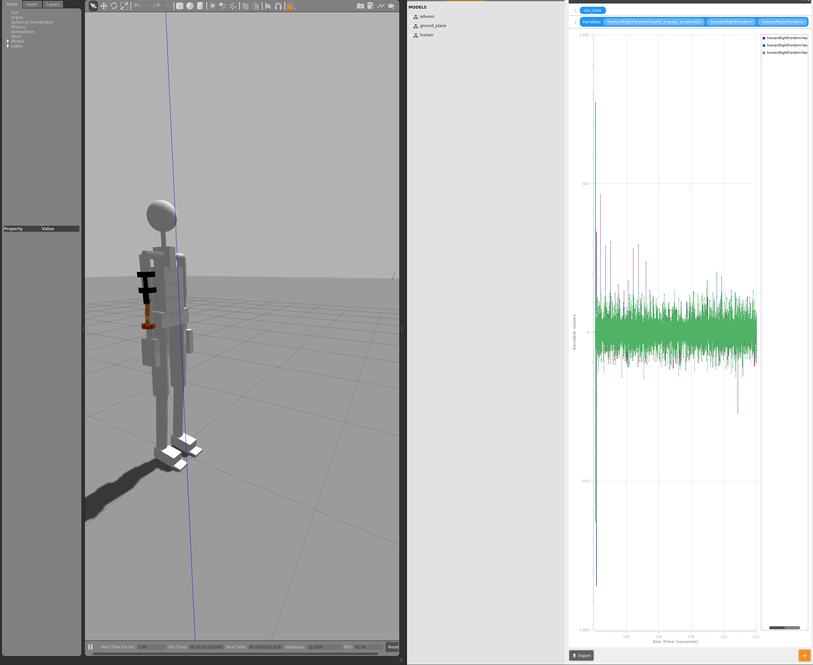

# gazebo 사용팁

gazebo 토픽 목록

&#x20;`gz topic -l`

gazebo 특정 토픽 보기&#x20;

`gz topic -v /gazebo/default/robot_name/Pelvis/wrench`

\---


모델의 joint와 link으 가속도, 속도, 위치 값을 볼수 있음&#x20;

.png>)


실시간 그래프, csv, pdf 출력

<figure><figcaption></figcaption></figure>

csv 출력 예시

```
sim_time, human/RightForeArm?world_angular_acceleration/x
732.261, -0.998975
732.262, 5.23197
732.263, 48.7125
732.264, -40.3591
732.265, -0.974806
732.266, -7.49022
732.267, 47.7811
```


오른팔 팔꿈치 joint

.png>)

오른팔 팔꿈치 아래팔  link

.png>)
