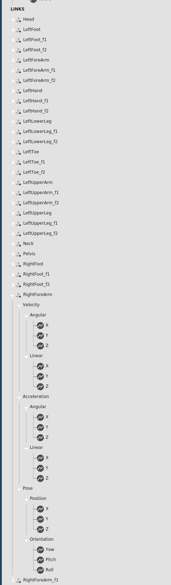

# 1 자유도 로봇 모델 제작

### 목적

실제 웨어러블 로봇의 제작을 앞서 가제보와 ROS의 기능 테스트를 위한 간단 버전 로봇 모델 제작

#### 개발 환경

* URDF 뷰어: vscode에서 ros\_extension을 설치하여 URDF 결과물을 미리 보면서 편집&#x20;
* ROS 2 개발환경:  Ubuntu 20.04, ROS 2 Foxy, Gazebo 11

#### Gazebo에서 로봇 모델 작성하는 순서&#x20;

1​. URDF 작성.

2\. robot state publisher 노드 를 이용하여  robot\_description 노드에 로봇의 URDF 보내기.

3​. gazebo에 URDF로 정의된 로봇 올리기:  spawn\_entity.py

4​ joint state publisher와 joint state broadcaster 노드 를 이용하여 joint 상태를 토픽으로 출판.

5\. joint trajetory controller 노드 를 이용하여 robot의 joint를 ROS action으로 제어하도록 인터페이스 연결

### 구현 <a href="#undefined-2" id="undefined-2"></a>

[https://github.com/donghee/wearable\_robot\_eval](https://github.com/donghee/wearable\_robot\_eval)

`colcon build && source ./install/setup.bash && ros2 launch wearable_robot_gazebo 1_dof_arm.launch.py`

<figure><figcaption></figcaption></figure>

#### 1 자유도 로봇

1​ 자유도 로봇 모델&#x20;

URDF 파일

```
<?xml version="1.0"?>
<robot name="1_dof_arm" xmlns:xacro="http://www.ros.org/wiki/xacro">

  <!-- Import all Gazebo-customization elements, including Gazebo colors -->
  <xacro:include filename="$(find wearable_robot_description)/urdf/1_dof_arm.gazebo"/>
  <!-- Import Rviz colors -->
  <xacro:include filename="$(find wearable_robot_description)/urdf/materials.xacro"/>

    <link name="world"/>

    <joint name="fixed" type="fixed">
        <parent link="world"/>
        <child link="arm_link"/>
    </joint>

    <link name="arm_link">
        <visual>
            <geometry>
                <cylinder length="0.3" radius="0.01"/>
            </geometry>
            <origin rpy="0 0 1.570796" xyz="0.72 1 1.275"/>
            <material name="blue">
                <color rgba="0 0 1 1"/>
            </material>
        </visual>
        <collision>
            <geometry>
                <cylinder length="0.3" radius="0.01"/>
            </geometry>
            <origin rpy="0 0 1.570796" xyz="0.72 1 1.275"/>
        </collision>
        <inertial>
            <mass value="0.5"/>
            <inertia ixx="1.0" ixy="0.0" ixz="0.0" iyy="1.0" iyz="0.0" izz="1.0"/>
        </inertial>
    </link>

    <joint name="arm_joint" type="revolute">
        <parent link="arm_link"/>
        <child link="forearm_link"/>
        <origin xyz="0.72 1 1.125"/>
        <axis xyz="0 0 0" />
        <!-- <limit effort="300" velocity="0.1" lower="4.71" upper="1.8"/> -->
        <limit effort="300" velocity="0.1" lower="-4.1" upper="-1.5"/>
        <dynamics damping="50" friction="1"/>
    </joint>

    <link name="forearm_link">
        <visual>
            <geometry>
                <cylinder length="0.25" radius="0.01"/>
            </geometry>
            <origin rpy="1.570796 0 0" xyz="0 0.125 0"/>
            <material name="red">
                <color rgba="1 0 0 1"/>
            </material>
        </visual>
        <collision>
            <geometry>
                <cylinder length="0.25" radius="0.01"/>
            </geometry>
            <origin rpy="1.570796 0 0" xyz="0 0.125 0"/>
        </collision>
        <inertial>
            <mass value="0.5"/>
            <inertia ixx="1.0" ixy="0.0" ixz="0.0" iyy="1.0" iyz="0.0" izz="1.0"/>
        </inertial>
    </link>

    <joint name="forearm_band_link_fix_to_forearm_link" type="fixed">
      <origin xyz="0.12 0.18 0.05" rpy="0 1.570796 0"/>
      <parent link="forearm_link"/>
      <child link="forearm_band_link"/>
    </joint>

    <link name="forearm_band_link">
      <visual>
        <geometry>
          <cylinder length="0.01" radius="0.005"/>
        </geometry>
        <origin rpy="0 0 0" xyz="0 0 0"/>
        <material name="red">
          <color rgba="1 0 0 1"/>
        </material>
      </visual>
      <visual>
        <geometry>
          <cylinder length="0.01" radius="0.005"/>
        </geometry>
        <origin rpy="0 0 0" xyz="0.1 0 0"/>
        <material name="red">
          <color rgba="1 0 0 1"/>
        </material>
      </visual>
      <collision>
        <geometry>
          <cylinder length="0.05" radius="0.02"/>
        </geometry>
        <origin rpy="0 0 0" xyz="0 0 0"/>
        <contact_coefficients mu="2.0" kp="2.0" kd="2.0" />
      </collision>
      <collision>
        <geometry>
          <cylinder length="0.05" radius="0.02"/>
        </geometry>
        <origin rpy="0 0 0" xyz="0.1 0 0"/>
        <contact_coefficients mu="2.0" kp="2.0" kd="2.0" />
      </collision>
      <inertial>
        <mass value="0.1"/>
        <inertia ixx="1e-2" iyy="1e-2" izz="1e-2" ixy="0" ixz="0" iyz="0"/>
      </inertial>
    </link>

    <joint name="arm_band_link_fix_to_arm_link" type="fixed">
      <!-- <origin xyz="0.12 0.19 0.05" rpy="0 1.570796 0"/> -->
      <origin xyz="0.85 0.95 1.25" rpy="0 0 1.570796"/>
      <axis xyz="0 0 0" />
      <parent link="arm_link"/>
      <child link="arm_band_link"/>
    </joint>

    <link name="arm_band_link">
      <visual>
        <geometry>
          <cylinder length="0.01" radius="0.005"/>
        </geometry>
        <origin rpy="0 0 0" xyz="0.0 0 0"/>
        <material name="red">
          <color rgba="1 0 0 1"/>
        </material>
      </visual>
      <visual>
        <geometry>
          <cylinder length="0.01" radius="0.005"/>
        </geometry>
        <origin rpy="0 0 0" xyz="0.1 0 0"/>
        <material name="red">
          <color rgba="1 0 0 1"/>
        </material>
      </visual>
      <collision>
        <geometry>
          <cylinder length="0.05" radius="0.005"/>
        </geometry>
        <origin rpy="0 0 0" xyz="0 0 0"/>
        <contact_coefficients mu="2.0" kp="2.0" kd="2.0" />
      </collision>
      <collision>
        <geometry>
          <cylinder length="0.05" radius="0.005"/>
        </geometry>
        <origin rpy="0 0 0" xyz="0.1 0 0"/>
        <contact_coefficients mu="2.0" kp="2.0" kd="2.0" />
      </collision>
      <inertial>
        <mass value="0.1"/>
        <inertia ixx="1e-2" iyy="1e-2" izz="1e-2" ixy="0" ixz="0" iyz="0"/>
      </inertial>
    </link>

  <ros2_control name="GazeboSystem" type="system">
    <hardware>
      <plugin>gazebo_ros2_control/GazeboSystem</plugin>
    </hardware>
    <joint name="arm_joint">
      <command_interface name="position">
        <param name="min">1.79</param>
        <param name="max">6.28</param>
      </command_interface>
      <state_interface name="position"/>
      <state_interface name="velocity"/>
    </joint>
  </ros2_control>

</robot>

```

#### joint 제어

```
from math import sin, cos, pi
import rclpy
from rclpy.node import Node
from rclpy.qos import QoSProfile
from geometry_msgs.msg import Quaternion
from sensor_msgs.msg import JointState

class StatePublisher(Node):

    def __init__(self):
        rclpy.init()
        super().__init__('state_publisher')

        qos_profile = QoSProfile(depth=10)
        self.joint_pub = self.create_publisher(JointState, 'joint_states', qos_profile)
        self.nodeName = self.get_name()
        self.get_logger().info("{0} started".format(self.nodeName))

        degree = pi / 180.0
        loop_rate = self.create_rate(10)

        # robot state
        tilt_joint = 2.0
        tinc = degree
        tinc = 0.15

        joint_state = JointState()

        try:
            while rclpy.ok():
                rclpy.spin_once(self)

                # update joint_state
                now = self.get_clock().now()
                joint_state.header.stamp = now.to_msg()
                joint_state.name = ['tilt_joint']
                joint_state.position = [tilt_joint]

                self.joint_pub.publish(joint_state)

                tilt_joint += tinc
                if tilt_joint < 1.8 or tilt_joint > 4.71:
                    tinc *= -1

                # This will adjust as needed per iteration
                loop_rate.sleep()

        except KeyboardInterrupt:
            pass

def main():
    node = StatePublisher()

if __name__ == '__main__':
    main()

```

#### RVIZ 설정&#x20;

RVIZ에서 로봇 모델이 보이지 않는 경우 RobotModel Display를 추가하고 RobotModel의 Description Topic 항복에 /robot\_description 토픽 추가&#x20;

<figure><figcaption></figcaption></figure>


```


Panels:
  - Class: rviz_common/Displays
    Help Height: 85
    Name: Displays
    Property Tree Widget:
      Expanded:
        - /Global Options1
        - /Status1
        - /RobotModel1
      Splitter Ratio: 0.5
    Tree Height: 711
  - Class: rviz_common/Selection
    Name: Selection
  - Class: rviz_common/Tool Properties
    Expanded:
      - /2D Goal Pose1
      - /Publish Point1
    Name: Tool Properties
    Splitter Ratio: 0.5886790156364441
  - Class: rviz_common/Views
    Expanded:
      - /Current View1
    Name: Views
    Splitter Ratio: 0.5
Visualization Manager:
  Class: ""
  Displays:
    - Alpha: 0.5
      Cell Size: 1
      Class: rviz_default_plugins/Grid
      Color: 160; 160; 164
      Enabled: true
      Line Style:
        Line Width: 0.029999999329447746
        Value: Lines
      Name: Grid
      Normal Cell Count: 0
      Offset:
        X: 0
        Y: 0
        Z: 0
      Plane: XY
      Plane Cell Count: 10
      Reference Frame: <Fixed Frame>
      Value: true
    - Alpha: 1
      Class: rviz_default_plugins/RobotModel
      Collision Enabled: false
      Description File: ""
      Description Source: Topic
      Description Topic:
        Depth: 5
        Durability Policy: Volatile
        History Policy: Keep Last
        Reliability Policy: Reliable
        Value: /robot_description
      Enabled: true
      Links:
        All Links Enabled: true
        Expand Joint Details: false
        Expand Link Details: false
        Expand Tree: false
        Link Tree Style: Links in Alphabetic Order
        pan_link:
          Alpha: 1
          Show Axes: false
          Show Trail: false
          Value: true
        tilt_link:
          Alpha: 1
          Show Axes: false
          Show Trail: false
          Value: true
      Name: RobotModel
      TF Prefix: ""
      Update Interval: 0
      Value: true
      Visual Enabled: true
    - Class: rviz_default_plugins/TF
      Enabled: true
      Frame Timeout: 15
      Frames:
        All Enabled: true
        pan_link:
          Value: true
        tilt_link:
          Value: true
      Marker Scale: 1
      Name: TF
      Show Arrows: true
      Show Axes: true
      Show Names: false
      Tree:
        pan_link:
          tilt_link:
            {}
      Update Interval: 0
      Value: true
  Enabled: true
  Global Options:
    Background Color: 48; 48; 48
    Fixed Frame: pan_link
    Frame Rate: 30
  Name: root
  Tools:
    - Class: rviz_default_plugins/Interact
      Hide Inactive Objects: true
    - Class: rviz_default_plugins/MoveCamera
    - Class: rviz_default_plugins/Select
    - Class: rviz_default_plugins/FocusCamera
    - Class: rviz_default_plugins/Measure
      Line color: 128; 128; 0
    - Class: rviz_default_plugins/SetInitialPose
      Topic:
        Depth: 5
        Durability Policy: Volatile
        History Policy: Keep Last
        Reliability Policy: Reliable
        Value: /initialpose
    - Class: rviz_default_plugins/SetGoal
      Topic:
        Depth: 5
        Durability Policy: Volatile
        History Policy: Keep Last
        Reliability Policy: Reliable
        Value: /goal_pose
    - Class: rviz_default_plugins/PublishPoint
      Single click: true
      Topic:
        Depth: 5
        Durability Policy: Volatile
        History Policy: Keep Last
        Reliability Policy: Reliable
        Value: /clicked_point
  Transformation:
    Current:
      Class: rviz_default_plugins/TF
  Value: true
  Views:
    Current:
      Class: rviz_default_plugins/Orbit
      Distance: 2.312662124633789
      Enable Stereo Rendering:
        Stereo Eye Separation: 0.05999999865889549
        Stereo Focal Distance: 1
        Swap Stereo Eyes: false
        Value: false
      Focal Point:
        X: 0
        Y: 0
        Z: 0
      Focal Shape Fixed Size: true
      Focal Shape Size: 0.05000000074505806
      Invert Z Axis: false
      Name: Current View
      Near Clip Distance: 0.009999999776482582
      Pitch: 0.34039855003356934
      Target Frame: <Fixed Frame>
      Value: Orbit (rviz)
      Yaw: 4.750417709350586
    Saved: ~
Window Geometry:
  Displays:
    collapsed: false
  Height: 959
  Hide Left Dock: false
  Hide Right Dock: false
  QMainWindow State: 000000ff00000000fd00000004000000000000015a0000035dfc0200000008fb0000001200530065006c0065006300740069006f006e00000001e10000009b0000006b00fffffffb0000001e0054006f006f006c002000500072006f007000650072007400690065007302000001ed000001df00000185000000a3fb000000120056006900650077007300200054006f006f02000001df000002110000018500000122fb000000200054006f006f006c002000500072006f0070006500720074006900650073003203000002880000011d000002210000017afb000000100044006900730070006c00610079007301000000440000035d000000eb00fffffffb0000002000730065006c0065006300740069006f006e00200062007500660066006500720200000138000000aa0000023a00000294fb00000014005700690064006500530074006500720065006f02000000e6000000d2000003ee0000030bfb0000000c004b0069006e0065006300740200000186000001060000030c0000026100000001000001020000035dfc0200000003fb0000001e0054006f006f006c002000500072006f00700065007200740069006500730100000041000000780000000000000000fb0000000a0056006900650077007301000000440000035d000000b900fffffffb0000001200530065006c0065006300740069006f006e010000025a000000b200000000000000000000000200000490000000a9fc0100000001fb0000000a00560069006500770073030000004e00000080000002e10000019700000003000004420000003efc0100000002fb0000000800540069006d00650100000000000004420000000000000000fb0000000800540069006d0065010000000000000450000000000000000000000a6d0000035d00000004000000040000000800000008fc0000000100000002000000010000000a0054006f006f006c00730100000000ffffffff0000000000000000
  Selection:
    collapsed: false
  Tool Properties:
    collapsed: false
  Views:
    collapsed: false
  Width: 3287
  X: 4389
  Y: 20

```


참고: [https://docs.ros.org/en/foxy/Tutorials/Intermediate/URDF/Building-a-Visual-Robot-Model-with-URDF-from-Scratch.html](https://docs.ros.org/en/foxy/Tutorials/Intermediate/URDF/Building-a-Visual-Robot-Model-with-URDF-from-Scratch.html)


