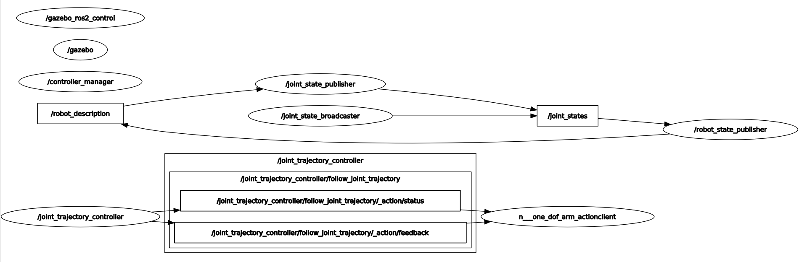

# EduExo 로봇 모델 제작

### 목적

실제  EXOSKELETION 로봇의 시뮬레이션 모델을 구성하고, 제어 프로그램을 이용하여 제어해보자.

### 구현 <a href="#undefined-2" id="undefined-2"></a>

#### https://github.com/donghee/wearable\_robot\_eval


`colcon build && source ./install/setup.bash && ros2 launch wearable_robot_gazebo eduexo.launch.py`

```
cd ~/ros2_ws/src/wearable_robot_eval/wearable_robot_description/scripts
python3 1_dof_arm_gazebo_test.py 3.14
```

<figure><figcaption></figcaption></figure>

### 실행 노​드 구조&#x20;

<figure><figcaption></figcaption></figure>

Topic 설명&#x20;

`/robot_state_publisher` : [/joint\_state](https://docs.ros2.org/foxy/api/sensor\_msgs/msg/JointState.html) JointState 를 구독하여,  [/robot\_description](https://docs.ros2.org/foxy/api/std\_msgs/msg/String.html) Robot 모델 URDF와 TF를 출판.

`/joint_state_publisher` : [/robot\_description](https://docs.ros2.org/foxy/api/std\_msgs/msg/String.html) URDF에서 Joint를 읽고,  [/joint\_state](https://docs.ros2.org/foxy/api/sensor\_msgs/msg/JointState.html) JointState  값을 출판

`/joint_state_broadcaster` : 하드웨어의 인터페이스 상태와 리포트 읽어서,  [/joint\_state](https://docs.ros2.org/foxy/api/sensor\_msgs/msg/JointState.html),[`/dynamic_joint_states`](https://github.com/ros-controls/control\_msgs/blob/galactic-devel/control\_msgs/msg/DynamicJointState.msg) JointState 출판. [ros2\_controllers](https://github.com/ros-controls/ros2\_controllers) 패키지.

`/gazebo_ros2_control` : Gazebo 시뮬레이터와 [ros2\_control](https://github.com/ros-controls/ros2\_control) 연결하는 인터페이스

`/gazebo`: Gazebo 시뮬레이터의 ROS 인터페이스

`/controller_manager`: [ros2\_control](https://github.com/ros-controls/ros2\_control)의 컨트롤러 매니저. [하드웨어 인터페이스](https://github.com/ros-controls/ros2\_control/blob/master/controller\_manager\_msgs/msg/HardwareComponentState.msg)와 [ros2\_controllers](https://github.com/ros-controls/ros2\_controllers) 패키지의 [control 라이프](https://github.com/ros-controls/ros2\_control/blob/master/controller\_manager\_msgs/srv/SwitchController.srv) 사이클 제어


Action 설명

`/joint_trajectory_controller` : Joints 제어 컨트롤러.  [ros2\_controllers](https://github.com/ros-controls/ros2\_controllers) 패키지.

`/one_dof_arm_actionclient` : `joint_trajectory_controller 액션 서버의 클라이언트. joint 각도를 서버에 전송.`&#x20;


#### 참고

* [https://control.ros.org/foxy/index.html](https://control.ros.org/foxy/index.html) ros2\_control 프레임워크
* [https://control.ros.org/master/doc/ros2\_controllers/joint\_state\_broadcaster/doc/userdoc.html](https://control.ros.org/master/doc/ros2\_controllers/joint\_state\_broadcaster/doc/userdoc.html)
* [http://docs.ros.org/en/humble/p/joint\_state\_broadcaster](http://docs.ros.org/en/humble/p/joint\_state\_broadcaster/)


