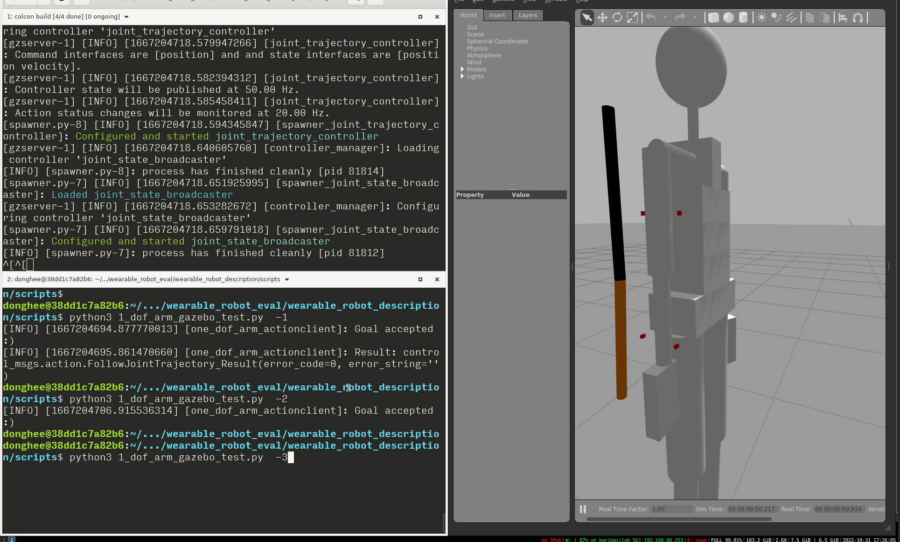

# URDF 링크 충돌 테스트

테스트 목적: 웨어러블 로봇이 human 모델에 장착이 되기 위해서는 웨어러블 로봇 링크와 human의 링크가 서로 맞대고(충돌) 있어야 한다. 링크가 잘 맞대지는 확인 하기 위해서 링크 충돌 테스트 진행

준비물: human 모델, 웨어러블 로봇 모델&#x20;

### 테스트 수행&#x20;

테스트 #1  웨어러블 로봇 모델을 움직였을때 human 모델의 링크가 충돌이 되어 움직임이 있는 지 확인

<figure><figcaption></figcaption></figure>

<figure><figcaption></figcaption></figure>
