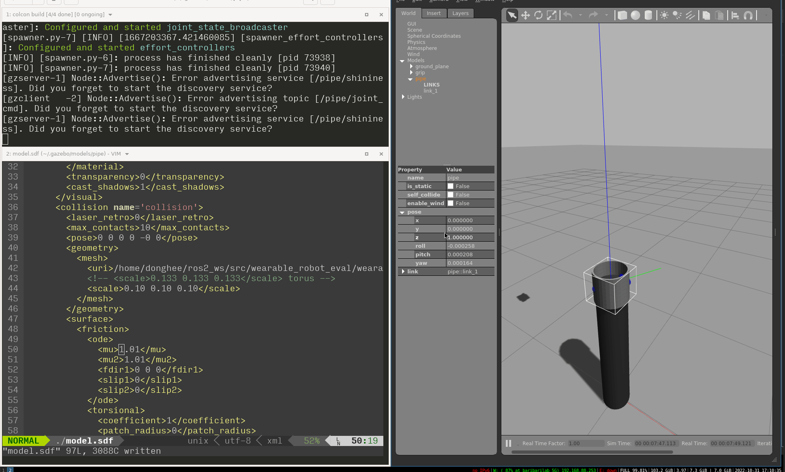

# URDF 링크 마찰력 테스트

테스트 목적: 웨어러블 로봇이 human 모델에 장착이 되기 위해서는 웨어러블 로봇과 human 로봇에 마찰과 웨어러블 로봇이 human을 조이는 힘이 필요하다. 여기서는 웨어러블 로봇과 human 로봇의 마찰력을 테스트 하였다.

준비물: 실린더 링크(검정) 와 파이프 링크(회색) 준비&#x20;

테스트 #1 정지 마찰계수, 운동 마찰계수를 각각 0.01로 설정 : 회색 파이프 링크의 정지 마찰계수(mu1), 운동 마찰계수(mu2) 값을 각각 0.01로 했을때, 회색 파이프는 검정색 실린더에서 미끄러진다.&#x20;

<figure><figcaption>
mu1: 0.01, mu2: 0.01
</figcaption></figure>

회색 파이프 링크의 mu1, mu2의 값을 각각 1.01로 했을때, 회색 파이프는 검정색 실린더에서 미끄러지지 않는다.&#x20;

<figure><figcaption>
mu1: 1.01, mu2: 1.01
</figcaption></figure>

Q: Gazebo에서 마찰력의 Normal Force는 지정 할 수 있나?

마찰력의 Normal Force 는 물리엔진에서 계산이 된다.

참고:&#x20;

[https://github.com/gazebosim/gazebo-classic/blob/gazebo11/deps/opende/src/box.cpp#L332](https://github.com/gazebosim/gazebo-classic/blob/gazebo11/deps/opende/src/box.cpp#L332)

[https://classic.gazebosim.org/tutorials?tut=friction\&cat=physics](https://classic.gazebosim.org/tutorials?tut=friction\&cat=physics)

> How friction works
>
> When two object collide, such as a ball rolling on a plane, a friction term is generated. In ODE this is composed of two parts, '''mu''' and '''mu2''', where:
>
> 1. '''mu''' is the Coulomb friction coefficient for the first friction direction, and
> 2. '''mu2''' is the friction coefficient for the second friction direction (perpendicular to the first friction direction).
>
> **ODE will automatically compute the first and second friction directions for us**.

ODE의 마찰력 모델: [https://ode.org/ode-latest-userguide.html#sec\_3\_11\_1](https://ode.org/ode-latest-userguide.html#sec\_3\_11\_1)

